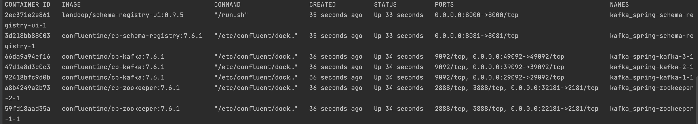

### Spring kafka 
Implementation Demo of kafka producers and consumers using spring boot and docker.

### Prerequisites
You need to have :
- Docker installed
- At least Java: <b>17</b> installed
- maven

### Used technologies (See  [docker-compose](./docker-compose.yml) and [pom.xml](./pom.xml))
- Java: <b>[17]</b>
- spring boot: <b>[3.2.6]</b>
- spring-kafka
- org.apache.avro
- kafka-avro-serializer <b>[7.4.0]</b> of io.confluent (To serialize avro messages).
- kafka-schema-registry-client <b>[7.4.0]</b> of io.confluent (To interact with the schema registry)
- avro-maven-plugin <b>[1.11.0]</b> (To generate java pojo from avro schema)

### Start kafka brokers and schema registry 
Before starting (KafkaProducer, KafkaConsumer) we need to start kafka brokers, zookeeper and schema registry

The file [docker-compose](./docker-compose.yml) start zookeeper with 3 brokers kafka, and start also a schema registry
and schema registry ui. To do that you have to run the cmd bellow 
```console
docker-compose up
```

### Check started containers by running the command
```console
docker ps 
```


### Create topics to test the KafkaProducer and KafkaConsumer applications
We will create three topics (stringTopic, jsonTopic and avroTopic). So you have to run the three commands bellow
```console
docker exec -it kafka_spring-kafka-1-1 kafka-topics --bootstrap-server kafka-1:9092 --topic stringTopic --create --replication-factor 2 --partitions 2

docker exec -it kafka_spring-kafka-1-1 kafka-topics --bootstrap-server kafka-1:9092 --topic jsonTopic --create --replication-factor 2 --partitions 2

docker exec -it kafka_spring-kafka-1-1 kafka-topics --bootstrap-server kafka-1:9092 --topic avroTopic --create --replication-factor 2 --partitions 2
```

### Create an avro schema for the topic 'avroTopic'
- Go to the [schema registry UI](http://localhost:8000/) and click on 'New' button
- <b>Subject Name:</b> avroTopic-value
- <b>Schema:</b>
```json
{
  "type": "record",
  "name": "UserRecord",
  "doc": "This is a sample Avro schema for the entity user",
  "namespace": "com.kafka.dto",
  "fields": [
    {
      "name": "firstName",
      "type": "string"
    },
    {
      "name": "size",
      "type": "int"
    }
  ]
}
```

### Start KafkaProducer application
- Open terminal and go to KafkaProducer folder and then run
```console
mvn spring-boot:run
```

### Tool to check published messages into topics (Optional)
In the steps before we will use KafkaProducer application to publish messages into topics.
There are two possibilities to check if messages are sent to kafka topics:
#### 1- Via terminal
replace topicName by the topic name that you went to check !
```console
docker container exec -it kafka_spring-kafka-1-1 /bin/bash

kafka-console-consumer --bootstrap-server localhost:9092 --topic topicNme -from-beginning
```
#### 2- Via a web ui 
You can use for example [Offset Explorer](https://www.kafkatool.com/)
You can configure web explorer connexion to kafka cluster like shown bellow :
- <i>Cluster name:</i> kafka_spring
- <i>Bootstrap servers:</i> localhost:29092,localhost:39092,localhost:49092
- <i>Kafka cluster version:</i> 3.7
- <i>Zookeeper Host:</i> localhost
- <i>Zookeeper port:</i> 22181
- <i>chroot path:</i> /

### Test KafkaProducer application
Go to [KafkaProducer API](http://localhost:8080/swagger-ui/index.html)

#### Publish string message into stringTopic
Endpoint [Send string message](http://localhost:8080/swagger-ui/index.html#/rest-publisher/sendStringMessage)
- topic: stringTopic
- key: myFirstKey
- Request body: myFamousMessage

#### Publish json message into stringTopic
Endpoint [Send json message API](http://localhost:8080/swagger-ui/index.html#/rest-publisher/sendJsonMessage)
- topic: jsonTopic
- key: myFirstKey
- Request body:
```json
{
  "id":3,
  "owner":"root",
  "pay":1300
}
```

#### Publish a UserRecord message into avroTopic
Endpoint [Send UserRecord message API](http://localhost:8080/swagger-ui/index.html#/rest-publisher/sendUserMessage)
- topic: avroTopic
- key: myFirstKey
- Request body:
```json
{
   "firstName":"titi",
   "size":123
}
```

#### Publish any record message into an avro topic
1. Let create a new topic with name : genericAvroTopic 
```console
docker exec -it kafka_spring-kafka-1-1 kafka-topics --bootstrap-server kafka-1:9092 --topic genericAvroTopic --create --replication-factor 2 --partitions 2
```

2. Save a new avro schema in the schema registry <br>
- <b>Subject Name:</b> genericAvroTopic-value
- <b>Schema:</b>
```json
{
   "namespace":"openclassrooms.openstreetmap",
   "type":"record",
   "name":"Node",
   "fields":[
      {
         "name":"id",
         "type":"long"
      },
      {
         "name":"longitude",
         "type":"float"
      },
      {
         "name":"latitude",
         "type":"float"
      },
      {
         "name":"username",
         "type":"string"
      },
      {
         "name":"tags",
         "type":{
            "type":"map",
            "values":"string"
         }
      }
   ]
}
```

3. Publish an avro message into the created topic in last step
Endpoint [Send avro message API](http://localhost:8080/swagger-ui/index.html#/rest-publisher/sendAvroMessage)
- topic: genericAvroTopic
- key: myFirstKey
- Request body:
```json
{
   "id":123,
   "longitude":12.3,
   "latitude":23.1,
   "username":"root",
   "tags":{
      "key":"value"
   }
}
```